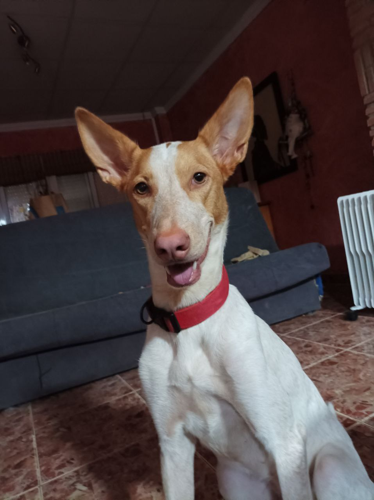

#### Mi tercer proyecto,aprendiendo a a manejar Markdown


# Titulo 1
## Titulo 2
### Titulo 3
#### Titulo 4
##### Titulo 5
###### Tiluo 6

Esto es un texto en *italic*

Esto es un texto en **negrita**

Esto es un ~~texto~~ tachado

<!-- Listas desordenadas -->

* manzana
    * manzana
        * manzana
* naranja
    * naranja
* lo que sea

<!-- Listas ordenadas -->

1. manzana
    1. manzana
2. naranja
    1. naranja
    2. naranja 2
        1. naranja
3. lo que sea
4. se necesita poner el punto

<!-- Enlaces -->

[Canal CreaGram](https://t.me/creagramES)

[Canal CreaGram](https://t.me/creagramES "canal")

<!-- crear citas -->

> Esto es una cita

---
___

<!-- pegar trozo de codigo -->

`console.log("hello world")`

<!--para que e codigo quede coloreado hay que escribir el lenguaje despues de las comillas invertidas -->

```python
LOGGER = logging.getLogger(__name__)

# if version < 3.6, stop bot.
if sys.version_info[0] < 3 or sys.version_info[1] < 6:
    LOGGER.error("You MUST have a python version of at least 3.6! Multiple features depend on this. Bot quitting.")
    quit(1)

ENV = bool(os.environ.get('ENV', False))

if ENV:
    TOKEN = os.environ.get('TOKEN', None)
    try:
        OWNER_ID = int(os.en

```

<!-- Crear Tablas-->

| Primera columna | Segunda columna | Tercera columna |
| -- | -- | -- |
| caguera | caguera2 | caguera3 |
| pisarra | pisarra2 | pisarra3 |
| merda | merda2 | merda3 |


<!-- entre parentesis tambien podriamos poner la direccion http de la foto,y lo de nombrar la foto como la gosseta es opcional -->

<!-- Github Markdown -->

* [x] Tarea1
* [ ] Tarea2
* [ ] Tarea3
* [x] Tarea4

@cervereta :kissing_closed_eyes: :+1:


